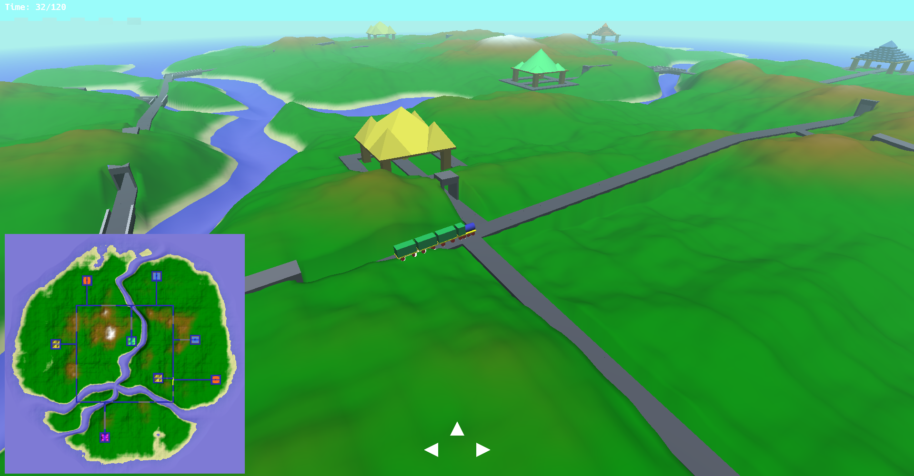
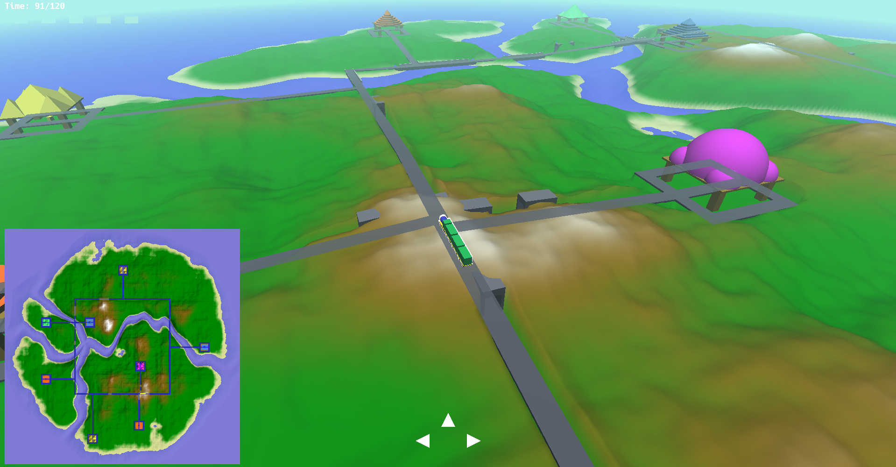

# Train Island

A 3D train simulation game built with OpenGL, where you navigate a locomotive across a procedurally generated island terrain. Collect resources from stations, deliver them before time runs out, and explore rivers, tunnels, and hills — all rendered in real time.

Built on top of the [GFX Framework](https://github.com/UPB-Graphics/gfx-framework-ppbg) from the Polytechnic University of Bucharest.

## Features

- **Procedural terrain generation** using Perlin noise with height-based coloring (sand, grass, hills)
- **River generation** with meandering paths and configurable properties
- **Rail network** connecting resource stations across the island, with bridges and tunnels
- **Train with wagons** — locomotive followed by cargo cars that trail along the rails
- **Resource stations** (wood, stone, coal, gold) with timed regeneration
- **Mission system** — collect requested resources and return to the central station before the timer expires
- **Directional lighting** with Phong shading
- **Occluded rendering** — train silhouette visible through terrain when in tunnels
- **Minimap** — top-down orthographic view of the island
- **On-screen UI** — directional controls, mission timer, and resource requests
- **Third-person camera** with mouse-controlled rotation and scroll zoom

## Controls

| Key / Input | Action |
|---|---|
| **W** | Move train forward |
| **A** | Turn train left |
| **D** | Turn train right |
| **Right-click + drag** | Rotate camera |
| **Scroll wheel** | Zoom in/out |
| **T** | Toggle camera target |

## Screenshots





### Demo

https://github.com/user-attachments/assets/8ff93738-4b85-4f70-beac-e271e95b7cbe

## Prerequisites

- **OS:** Linux (tested on Ubuntu), Windows, or macOS
- **Compiler:** g++ 5+ (Linux), Visual Studio 2015+ (Windows), clang++ 4+ (macOS)
- **CMake:** 3.16 or newer
- **OpenGL:** 3.3 core profile or newer

### Install dependencies (Linux)

```bash
# Debian/Ubuntu
sudo ./tools/deps-ubuntu.sh

# Fedora
sudo ./tools/deps-fedora.sh

# Arch
sudo ./tools/deps-arch.sh
```

## Building

```bash
mkdir -p build && cd build
cmake ..
make
```

## Running

```bash
cd build
./bin/Debug/GFXFramework
```

## Project Structure

```
src/
├── Game/
│   ├── IslandScene.cpp/h    # Main scene — rendering, camera, UI, game loop
│   ├── Terrain.cpp/h        # Procedural terrain, rivers, rails, stations
│   ├── trains.cpp/h         # Train locomotive + wagon logic and movement
│   ├── PerlinNoise.h        # 2D Perlin noise generator
│   └── shaders/
│       ├── VertexShader.glsl / FragmentShader.glsl      # Main lit shader
│       ├── VertexOccluded.glsl / FragmentOccluded.glsl  # Behind-terrain outline
│       └── VertexUI.glsl / FragmentUI.glsl              # HUD elements
├── Camera/
│   └── Camera.h             # Third-person camera implementation
└── main.cpp                 # Entry point
```

## License

This project uses the [GFX Framework](https://github.com/UPB-Graphics/gfx-framework-ppbg) which is available under the [MIT License](LICENSE.md).
